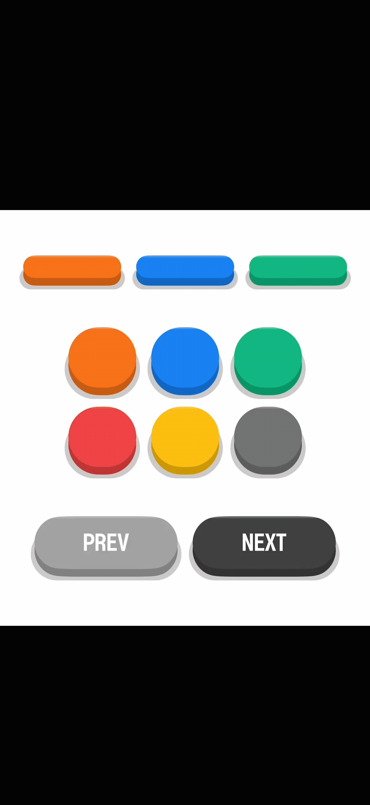

<h1 align="center">react-native-nongeo-world</h1>

<p align="center">A collection of free and customizable React Native components by Nongeoking.</p>

---

## Installation

```bash
npm install react-native-nongeo-world
```

or

```bash
yarn add react-native-nongeo-world
```

---

## Components

### ArcadeButton

A 3D-styled arcade button component with press animations and customizable appearance.

<p align="center">
  
</p>

#### Basic Usage

```tsx
import { ArcadeButton } from 'react-native-nongeo-world';
import { View, Text } from 'react-native';

// Simple button
<ArcadeButton
  buttonRadius="100%"
  wait={50}
  onPress={() => console.log('Pressed!')}
/>

// Button with custom background color
<ArcadeButton
  buttonRadius="100%"
  wait={50}
  backgroundColor="#3b82f6"
/>

// Button with text content
<ArcadeButton
  buttonRadius="100%"
  wait={50}
  backgroundColor="#6b7280"
>
  <Text style={{ fontSize: 24, color: 'white', fontWeight: 'bold' }}>
    NEXT
  </Text>
</ArcadeButton>

// Button with custom children
<ArcadeButton
  buttonRadius="100%"
  wait={50}
  backgroundColor="#ef4444"
>
  <View style={{ width: 1, height: 40 }} />
</ArcadeButton>
```

#### Multiple Buttons Layout

```tsx
<View
  style={{
    flexDirection: "row",
    justifyContent: "center",
    alignItems: "center",
    gap: 8,
    marginVertical: 16,
  }}
>
  <ArcadeButton buttonRadius="100%" wait={50} />
  <ArcadeButton buttonRadius="100%" wait={50} backgroundColor="#3b82f6" />
  <ArcadeButton buttonRadius="100%" wait={50} backgroundColor="#10b981" />
</View>
```

#### Props

| Prop                | Type                        | Default     | Description                                            |
| ------------------- | --------------------------- | ----------- | ------------------------------------------------------ |
| `buttonText`        | `string \| React.ReactNode` | `''`        | Button text or custom component                        |
| `buttonTextStyle`   | `StyleProp<TextStyle>`      | `undefined` | Text style for button text                             |
| `backgroundColor`   | `string`                    | `'#f97316'` | Button background color                                |
| `paddingVertical`   | `number`                    | `12`        | Vertical padding                                       |
| `paddingHorizontal` | `number`                    | `24`        | Horizontal padding                                     |
| `buttonRadius`      | `number \| string`          | `12`        | Border radius (supports percentage values like "100%") |
| `thickness`         | `number`                    | `8`         | 3D depth effect thickness                              |
| `hasBorder`         | `boolean`                   | `true`      | Show shadow border around button                       |
| `disabled`          | `boolean`                   | `false`     | Disable button interaction                             |
| `isLoading`         | `boolean \| null`           | `null`      | Show loading indicator                                 |
| `onPress`           | `() => void`                | `undefined` | Press event handler                                    |
| `isFullWidth`       | `boolean`                   | `false`     | Make button full width                                 |
| `children`          | `React.ReactNode`           | `undefined` | Custom content inside button                           |

---

## TypeScript Support

All components are written in TypeScript with full type definitions included.

```tsx
import { ArcadeButtonProps } from "react-native-nongeo-world";
```

---

## License

MIT © Nongeoking
